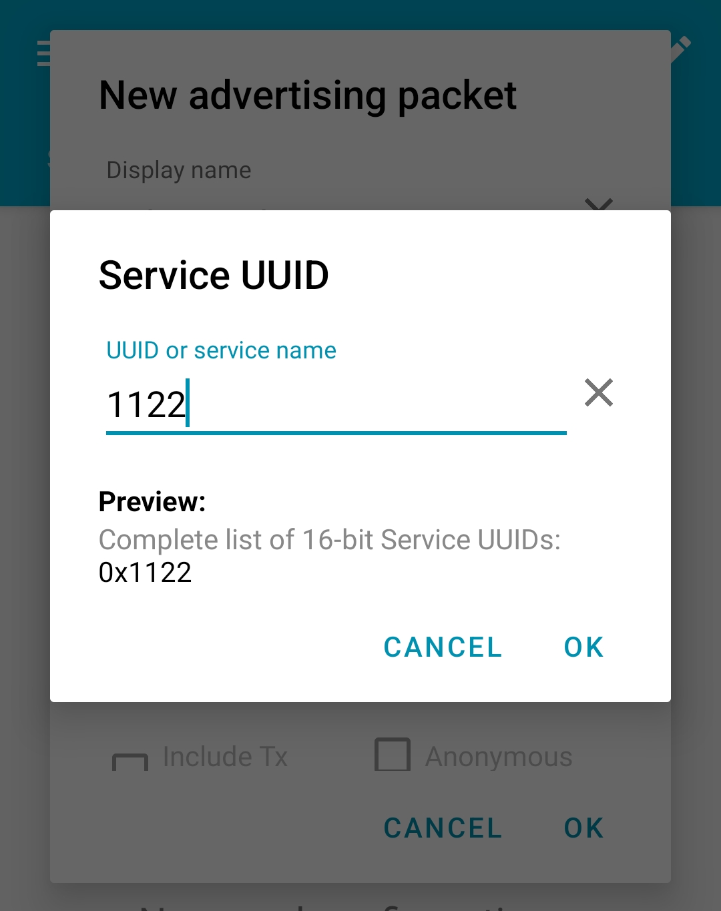

# AIROC™ BTSTACK: Bluetooth® WakeOnLE for Linux host

This code example demonstrates the Bluetooth® Low Energy WakeOnLE functionality with the AIROC™ Wi-Fi & Bluetooth® combo chip using Embedded Linux platforms (Arm® Cortex®-A Class processors).

The application demonstrates a LE vendor-specific device. After initialization of AIROC™ BTSTACK, set a specific UUID or UUID + Manufacture Data to the controller to wake up the controller and host when the controller receives the specific advertisement with a UUID or UUID + Manufacture Data. Use GPIO DEV-WAKE for the host to control the controller to enter sleep mode and wake up, another GPIO HOST-WAKE for the controller to notify the host.

[View this README on GitHub.](https://github.com/Infineon/linux-example-btstack-wakeonle)

[Provide feedback on this code example.](replace_code_example_voc_survey_url)

## Requirements

- Programming language: C
- Embedded Linux Host platforms (Arm® Cortex®-A Class processors). Supported Embedded Linux host platforms:
   1. RPI CM4-lite with custom HW base board from Infineon
   2. [IMX8 nano uCOM board](https://www.embeddedartists.com/products/imx8m-nano-developers-kit-v3/) from Embedded Artists
- AIROC™ BTSTACK library and Linux porting layer source code
- AIROC™ Wi-Fi & Bluetooth® combo chip Bluetooth® Firmware file (.hcd).
- Linux Host PC with Ubuntu 20.04


## Supported toolchains (make variable 'TOOLCHAIN')

- GNU Arm® GCC Arch64 v9.3.0 (`GCC_ARM`)

## Supported AIROC™ Wi-Fi & Bluetooth® combo chip

- [AIROC™ CYW5557x Wi-Fi & Bluetooth® combo chip](https://www.infineon.com/cms/en/product/wireless-connectivity/airoc-wi-fi-plus-bluetooth-combos/wi-fi-6-6e-802.11ax/)
- [AIROC™ CYW54591 Wi-Fi & Bluetooth® combo chip](https://www.infineon.com/cms/en/product/wireless-connectivity/airoc-wi-fi-plus-bluetooth-combos/wi-fi-5-802.11ac/cyw54591/)
- [AIROC™ CYW43439 Wi-Fi & Bluetooth® combo chip](https://www.infineon.com/cms/en/product/wireless-connectivity/airoc-wi-fi-plus-bluetooth-combos/wi-fi-4-802.11n/cyw43439/)
- [AIROC™ CYW43012 Wi-Fi & Bluetooth® combo chip](https://www.infineon.com/cms/en/product/wireless-connectivity/airoc-wi-fi-plus-bluetooth-combos/wi-fi-4-802.11n/cyw43012/)

## Hardware setup

Set up the hardware according to **Figure 1**:

**Figure 1. Block diagram: Hardware setup**


## Software setup

Set up a cross compiler according to the target platform along with CMake on the Linux host PC based on Ubuntu 20.04.

1. Open a terminal on the Linux host PC.

2. Use the following command to install the cross compiler, build tools, and dependencies:
   ```bash
   sudo apt-get install git cmake gcc-aarch64-linux-gnu build-essential -y
   ```

## Using the code example

Do the following on the Linux host PC to compile the code example:

1. Create a directory under `$HOME` on the Linux host PC and switch to the created directory. For example, use the following commands to switch:
   ```bash
   mkdir $HOME/Linux_CE
   cd $HOME/Linux_CE
   ```

2. Fetch the code example source code using the following:
   ```bash
   git clone https://github.com/Infineon/linux-example-btstack-wakeonle.git
   ```

3. Clone the code example dependencies (BTSTACK library and Linux porting layer source code) using the following commands:
   ```bash
   git clone https://github.com/Infineon/btstack.git --branch release-v3.6.1
   git clone https://github.com/Infineon/bluetooth-linux.git --branch release-v2.0.0
   ```

   Three different directories are created after cloning the code example and its dependencies, as shown in **Figure 2**.

   **Figure 2. Code example directory structure**

   

4. Use the following command to clone the Bluetooth® firmware:
   ```bash
   git clone https://github.com/Infineon/combo-bluetooth-firmware.git
   ```
   The user can choose appropriate Bluetooth® firmware for particular AIROC™ Wi-Fi & Bluetooth® combo chip from cloned "combo-bluetooth-firmware" directory.
5. Create the build folder under the code example source folder and use the following commands to build the code example:
   ```
   cd $HOME/Linux_CE/linux-example-btstack-wakeonle
   mkdir build && cd build
   cmake -DCMAKE_C_COMPILER:PATH=<GCC_CROSS_COMPILER> ../ && make
   ```
   Where, `GCC_CROSS_COMPILER` is the target cross compiler for GCC (generally */usr/bin/aarch64-linux-gnu-gcc* for Arm&reg;64-based targets)

   The code example executable is generated under the *build* folder with the same name of code example.

   For example, in this project, the "linux-example-btstack-wakeonle" executable is generated at */home/$USER/Linux_CE/linux-example-btstack-wakeonle/build*.

## Features demonstrated

- AIROC™ BTSTACK configuration initialization
- HARDWARE platform configuration
- Download controller firmware
- UART sleep mode low-active for BT_DEV_WAKE (DEV_WAKE) and BT_HOST_WAKE (HOST_WAKE)
- APCF settings
- HOST-WAKE and DEV-WAKE control and monitor
- 16-bit UUID setting for wake up
- 32-bit UUID setting for wake up
- 32-bit UUID + Manufacture Data settings for wake up
- Disable wake-up functionality


## Operation

This code example acts as LE Scanner. The remote device will be Advertiser.

The following two devices are required to demonstrate this application:
   - Hardware platform (Linux host platform + AIROC™ Wi-Fi &  combo chip, i.e., the device running the WakeOnLE application)
   - A LE advertiser application on mobile or laptop.

1. Take SSH console of target platform.
   ```bash
   ssh <TARGET_DEVICE_USER_NAME>@<TARGET_DEVICE_IP_ADDRESS>
   ```

2. Copy the code example executable and AIROC™ BTSTACK library from the Linux host PC to the target platform using [SCP](https://help.ubuntu.com/community/SSH/TransferFiles). For example, use the following commands:
   ```
   cd $HOME/Linux_CE/linux-example-btstack-wakeonle/lib
   scp libwiced_exp.so <TARGET_USER>@<TARGET_IP>:<TARGET_PATH>/.
   cd $HOME/Linux_CE/linux-example-btstack-wakeonle/build
   scp linux-example-btstack-wakeonle <TARGET_USER>@<TARGET_IP>:<TARGET_PATH>/.
   cd $HOME/Linux_CE/btstack/stack/COMPONENT_WICED_DUALMODE/COMPONENT_ARMv8_LINUX/COMPONENT_GCC
   scp libbtstack.so <TARGET_USER>@<TARGET_IP>:<TARGET_PATH>/.
   scp <FW_FILE.hcd> <TARGET_USER>@<TARGET_IP>:<TARGET_PATH>/.
   ```
   Where,
   - `TARGET_USER` is the user name of the target platform.
   - `TARGET_IP` is an IP address of the target platform.
   - `TARGET_PATH` is the path of target platform.
   - *`FW_FILE.hcd`* file is the Bluetooth® Firmware file cloned in [Using the code example section](#using-the-code-example).


3. Add the udev rule in the target host board for HCI UART and GPIO to bypass root access. Use the following steps to create and set up a udev rule.

   **Note:** If you have root access, the following udev rules are not required; you can execute the code example with `sudo` permissions or by switching to the root user.

   1. Create a new *.rules* (for example, *combo-chip-uart-port.rules*) file under the */etc/udev/rules.d/* directory for HCI UART. Use the following commands:

      **IMX8Nano:**

      ```bash
      echo "KERNEL==\"ttymxc0\"d,SYMLINK+=\"combo_chip_uart\",MODE=\"0666\"" | sudo tee /etc/udev/rules.d/combo-chip-uart-port.rules
      ```

      **RPICM4:**

      ```bash
      echo "KERNEL==\"ttyAMA0\",SYMLINK+=\"combo_chip_uart\",MODE=\"0666\"" | sudo tee /etc/udev/rules.d/combo-chip-uart-port.rules
      ```


   2. Create new *.rules* (for example, *combo-chip-gpio-port.rules*) for BT_REG_ON GPIO under the */etc/udev/rules.d/* directory. Use the following commands:

      **IMX8Nano & RPICM4:**

      1. Create a rule file using the following command:

         ```bash
         sudo vim /etc/udev/rules.d/combo-chip-gpio-port.rules.rules
         ```

      2. Add the following rules in created files:

         ```bash
         SUBSYSTEM=="gpio*", PROGRAM="/bin/sh -c 'chown -R $user:$group /sys/class/gpio/export /sys/class/gpio/unexport;'"
         SUBSYSTEM=="gpio*", PROGRAM="/bin/sh -c 'chown -R $user:$group /sys%p/direction /sys%p/value; chmod 660 /sys%p/direction /sys%p/value;'"
         ```


   3. Reboot the target device:

      ```bash
      sudo reboot
      ```
       Where,
      - `ttymxc0` and `ttyAMA0` are HCI UART ports for IMX8Nano and RPICM4 respectively
      - `combo_chip_uart` is a friendly name for the HCI UART port
      - `0666` is the permission mask to bypass the root access for HCI UART

4. Execute the application by setting the paths of the AIROC™ BTSTACK library using the following command on the target platform:
   ```
   cd <TARGET_PATH>
   chmod +x <APP_NAME>
   LD_LIBRARY_PATH=$LD_LIBRARY_PATH:<BTSTACK_LIB_PATH>
   ./<APP_NAME> -c <COM_PORT> -b <HCI_BAUDRATE> -f <FW_DL_BAUDRATE> -r <GPIOCHIPx> <REGONPIN> -n -p <FW_FILE_NAME>.hcd -d 112233221144 -w <GPIOCHIPx> <DEV-WAKE> -h <GPIOCHIPx> <HOST-WAKE>
   ```
   Where,
   - `TARGET_PATH` is the path of the target platform where the code example application copied to.
   - `BTSTACK_LIB_PATH` is the path of the AIROC™ BTSTACK library. Skip this if the AIROC™ BTSTACK library and code example application executable are in the same folder.
   - `COM_PORT` is the HCI communication port.
      - `/dev/ttymxc0` for IMX8Nano
      - `/dev/ttyAMA0` for RPICM4
   - `HCI_BAUDRATE` is the baud rate to be used for HCI communication.
      - `3000000` is the HCI baud rate
   - `112233221144` is the device BD address.
   - `-r <GPIOCHIPx> <REGONPIN> -n`  is setting the GPIO control to program the Bluetooth® firmware for the AIROC™ Wi-Fi + Bluetooth® combo chip.
      - `-r gpiochip5 0 -n` for IMX8Nano
      - `-r gpiochip0 3 -n` for RPICM4
   - `FW_DL_BAUDRATE` is the baud rate to be used for patch download; default value is 115200 if not specified. Different chips support different maximum download speed.
      - `921600` for [AIROC™ CYW5557x Wi-Fi & Bluetooth® combo chip](https://www.infineon.com/cms/en/product/wireless-connectivity/airoc-wi-fi-plus-bluetooth-combos/wi-fi-6-6e-802.11ax/)
      - `115200` for [AIROC™ CYW54591 Wi-Fi & Bluetooth® combo chip](https://www.infineon.com/cms/en/product/wireless-connectivity/airoc-wi-fi-plus-bluetooth-combos/wi-fi-5-802.11ac/cyw54591/)
      - `115200` for [AIROC™ CYW43439 Wi-Fi & Bluetooth® combo chip](https://www.infineon.com/cms/en/product/wireless-connectivity/airoc-wi-fi-plus-bluetooth-combos/wi-fi-4-802.11n/cyw43439/)
      - `115200` for [AIROC™ CYW43012 Wi-Fi & Bluetooth® combo chip](https://www.infineon.com/cms/en/product/wireless-connectivity/airoc-wi-fi-plus-bluetooth-combos/wi-fi-4-802.11n/cyw43012/)
   - *`.hcd`* is the firmware patch to download (make sure to validate this firmware patch file path)
   - `-w <GPIOCHIPx> <DEV-WAKE>` sets the GPIO of DEV-WAKE
      - `-w gpiochip1 7 ` for IMX8Nano
      - `-w gpiochip0 4 ` for RPICM4   
   - `-h <GPIOCHIPx> <HOST-WAKE>` sets the GPIO of HOST-WAKE
      - `-h gpiochip1 8 ` for IMX8Nano
      - `-h gpiochip0 12 `for RPICM4   

   **Note 1:** If you haven't set up a udev rule mentioned in Step 3, execute the command with `sudo` permissions.

   Wait for the download hcd file message from the console.
   ```
   ...
   Download pathfile <FW-FILE-NAME>.hcd
   ...
   patch_download_complete
   ...
   Patch successfully downloaded. Reset chip
   ```

5. To test using nRF Connect Android app on a smartphone as Bluetooth® LE Central, do the following:
   1. Download and install the nRFConnect app for [Android](https://play.google.com/store/apps/details?id=no.nordicsemi.android.mcp&hl=zh_TW&gl=US).

      Scan the following QR codes from your mobile phone to download the nRFConnect app.

      **Figure 3. Application QR code**

      

   2. Turn ON Bluetooth® on your Android device. Launch the nRFConnect app. Swipe down on the nRFConnect app ADVERTISER screen.

      **Figure 4. ADVERTISER app**

       

   3. Click '+' icon that is present in red to add the advertisement you want.

      **Figure 5. Add advertisement**

       

   4. Click "ADD RECORD" and click "Service UUID".

      **Figure 6. 16-bit UUID**

       

   5. Add more advertisement options.

      **Figure 7. Add 32-bit advertisement option**

       

      **Figure 8. Add 32-bit Manufacture Data advertisement**

       

## HowTo
   1. After the CE running and download FW complete, press 1 on the keyboard and press Enter, it will show the MENU.
   2. Press 3 on the keyboard and press Enter, to enable wakeonLe by the ADV packet with 16 bit UUID.
   3. Follow the instruction, eg: enter 11 22, need have a space between 11 and 22.
   4. After press Enter, it will show POLL GPIO 12, it means Controller enter WakeonLE mode successfully.
   5. Enable advertiser in nRFConnect APP from Android Phone to advertise the ADV which have the specific UUID, eg: "11 22"
   6. When you see "HOST WAKE ASSERT" in CE program, means Controller already receive this ADV and notify host through Host-Wake.
   7. In Menu option 5: 32 bit UUID and MANUFACTURE DATA. the MANUFACTURE DATA have 2 part, the first part is COMPANY_ID. It define in include/wakeon_le.h
	```
   #define COMPANY_ID				   0x0009
	```
   0x0009 is Infineon's company ID, change it to what you need.
   8. the second part of manufacture data is the data pattern.

## Debugging

You can debug the example using the following generic Linux debugging mechanism:

- **Debugging by logging:** Add prints in the application and check them during execution.

- **Debugging using GDB:** For more details, see [GDB man page](https://linux.die.net/man/1/gdb).

## Design and implementation

This code example does the following:

1. Parses the command-line arguments

2. Initializes the AIROC™ BTSTACK library for the AIROC™ combo chip.

  The WakeOnLE Application uses the following to achieve the WakeOnLE function:

   - UART Sleep Mode: Uses low active for BT_HOST_WAKE (HOST-WAKE) and BT_DEV_WAKE (DEV-WAKE)

   - APCF: 16-Bit UUID, 32-Bit UUID, and 32-Bit UUID + Manufacture Data.
    Manufacture Data include 2-byte company id, in this CE is 0x0009, change this company id to what you want.

  Wake-On-LE: Device Bluetooth® controller acts as an observer. When device Bluetooth® controller receives an advertisement with specific matching conditions, it wakes up the device host via BT_HOST_WAKE (HOST-WAKE).

  **Figure 9. System block diagram**

  

3. Wake-On-LE working flow:
  ```bash
  a. Clear APCF settings.
  b. Set APCF settings.
    i. Set APCF data UUID or Manufacture Data, or both.
    ii. Set APCF filter.
    iii. Enable APCF.
  c. Start LE scan.
  d. Set Sleep mode.
  e. Deassert GPIO DEV-WAKE from device host.
  f. Device host waits for GPIO HOST-WAKE assert.
  ```
  **Figure 10. Working flow**

  

4. Wake up flow

  **Figure 11. Wake up flow**

  

**Note:** It should use the callback "bt_sleep_cmpl_cback" function of set sleep mode to assert DEV-WAKE.

## Resources and settings

**Table 1. Application resources**

 Resource  |  Alias/object     |    Purpose
 :-------- | :-------------    | :------------
 UART |HCI| UART is used for HCI communication with host system

<br />

## Related resources

Resources  | Links
-----------|----------------------------------
Device documentation | [AIROC™ CYW5557x Wi-Fi 6E tri-band Wi-Fi and Bluetooth® 5.2 SoC](https://www.infineon.com/cms/en/product/wireless-connectivity/airoc-wi-fi-plus-bluetooth-combos/cyw5557x/) <br> [AIROC™ CYW54591 Wi-Fi & Bluetooth® combo chip](https://www.infineon.com/cms/en/product/wireless-connectivity/airoc-wi-fi-plus-bluetooth-combos/wi-fi-5-802.11ac/cyw54591/) <br> [AIROC™ CYW43439 Wi-Fi & Bluetooth® combo chip](https://www.infineon.com/cms/en/product/wireless-connectivity/airoc-wi-fi-plus-bluetooth-combos/wi-fi-4-802.11n/cyw43439/) <br> [AIROC™ CYW43012 Wi-Fi & Bluetooth® combo chip](https://www.infineon.com/cms/en/product/wireless-connectivity/airoc-wi-fi-plus-bluetooth-combos/wi-fi-4-802.11n/cyw43012/)
Libraries and middleware | [AIROC™ BTSTACK library](https://github.com/Infineon/btstack/tree/release-v3.6.1) <br> [Linux porting layer source code](https://github.com/Infineon/bluetooth-linux)


## Other resources

Infineon provides a wealth of data at www.infineon.com to help you select the right device, and quickly and effectively integrate it into your design.

## Document history

Document title: *CE237650* – *AIROC™ BTSTACK: Bluetooth® WakeOnLE for Linux host*

 Version | Description of change
 ------- | ---------------------
 1.0.0   | New code example


---------------------------------------------------------

© Cypress Semiconductor Corporation, 2023. This document is the property of Cypress Semiconductor Corporation, an Infineon Technologies company, and its affiliates ("Cypress").  This document, including any software or firmware included or referenced in this document ("Software"), is owned by Cypress under the intellectual property laws and treaties of the United States and other countries worldwide.  Cypress reserves all rights under such laws and treaties and does not, except as specifically stated in this paragraph, grant any license under its patents, copyrights, trademarks, or other intellectual property rights.  If the Software is not accompanied by a license agreement and you do not otherwise have a written agreement with Cypress governing the use of the Software, then Cypress hereby grants you a personal, non-exclusive, nontransferable license (without the right to sublicense) (1) under its copyright rights in the Software (a) for Software provided in source code form, to modify and reproduce the Software solely for use with Cypress hardware products, only internally within your organization, and (b) to distribute the Software in binary code form externally to end users (either directly or indirectly through resellers and distributors), solely for use on Cypress hardware product units, and (2) under those claims of Cypress’s patents that are infringed by the Software (as provided by Cypress, unmodified) to make, use, distribute, and import the Software solely for use with Cypress hardware products.  Any other use, reproduction, modification, translation, or compilation of the Software is prohibited.
<br />
TO THE EXTENT PERMITTED BY APPLICABLE LAW, CYPRESS MAKES NO WARRANTY OF ANY KIND, EXPRESS OR IMPLIED, WITH REGARD TO THIS DOCUMENT OR ANY SOFTWARE OR ACCOMPANYING HARDWARE, INCLUDING, BUT NOT LIMITED TO, THE IMPLIED WARRANTIES OF MERCHANTABILITY AND FITNESS FOR A PARTICULAR PURPOSE.  No computing device can be absolutely secure.  Therefore, despite security measures implemented in Cypress hardware or software products, Cypress shall have no liability arising out of any security breach, such as unauthorized access to or use of a Cypress product. CYPRESS DOES NOT REPRESENT, WARRANT, OR GUARANTEE THAT CYPRESS PRODUCTS, OR SYSTEMS CREATED USING CYPRESS PRODUCTS, WILL BE FREE FROM CORRUPTION, ATTACK, VIRUSES, INTERFERENCE, HACKING, DATA LOSS OR THEFT, OR OTHER SECURITY INTRUSION (collectively, "Security Breach").  Cypress disclaims any liability relating to any Security Breach, and you shall and hereby do release Cypress from any claim, damage, or other liability arising from any Security Breach.  In addition, the products described in these materials may contain design defects or errors known as errata which may cause the product to deviate from published specifications. To the extent permitted by applicable law, Cypress reserves the right to make changes to this document without further notice. Cypress does not assume any liability arising out of the application or use of any product or circuit described in this document. Any information provided in this document, including any sample design information or programming code, is provided only for reference purposes.  It is the responsibility of the user of this document to properly design, program, and test the functionality and safety of any application made of this information and any resulting product.  "High-Risk Device" means any device or system whose failure could cause personal injury, death, or property damage.  Examples of High-Risk Devices are weapons, nuclear installations, surgical implants, and other medical devices.  "Critical Component" means any component of a High-Risk Device whose failure to perform can be reasonably expected to cause, directly or indirectly, the failure of the High-Risk Device, or to affect its safety or effectiveness.  Cypress is not liable, in whole or in part, and you shall and hereby do release Cypress from any claim, damage, or other liability arising from any use of a Cypress product as a Critical Component in a High-Risk Device. You shall indemnify and hold Cypress, including its affiliates, and its directors, officers, employees, agents, distributors, and assigns harmless from and against all claims, costs, damages, and expenses, arising out of any claim, including claims for product liability, personal injury or death, or property damage arising from any use of a Cypress product as a Critical Component in a High-Risk Device. Cypress products are not intended or authorized for use as a Critical Component in any High-Risk Device except to the limited extent that (i) Cypress’s published data sheet for the product explicitly states Cypress has qualified the product for use in a specific High-Risk Device, or (ii) Cypress has given you advance written authorization to use the product as a Critical Component in the specific High-Risk Device and you have signed a separate indemnification agreement.
<br />
Cypress, the Cypress logo, and combinations thereof, WICED, ModusToolbox, PSoC, CapSense, EZ-USB, F-RAM, and Traveo are trademarks or registered trademarks of Cypress or a subsidiary of Cypress in the United States or in other countries. For a more complete list of Cypress trademarks, visit www.infineon.com. Other names and brands may be claimed as property of their respective owners.
